# MariaDB-EBS-Resillience
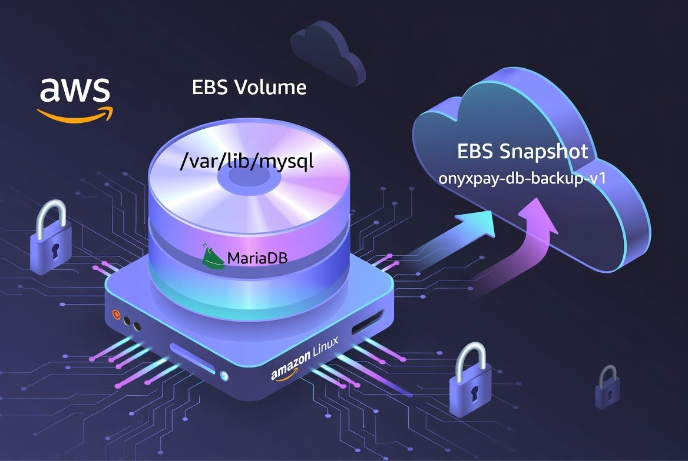
Production-ready MariaDB database deployed on AWS EC2 with persistent EBS storage and automated snapshot backups. Includes full backup, data-loss simulation, and instant recovery — demonstrating real-world cloud resilience and disaster recovery skills.

## Project Overview
OnyxPay Ltd needed a database that **never loses data** even if the server crashes, supports regular backups, and allows instant recovery from accidental deletions.  

## Architecture
```
Application/User
↓
EC2 Instance (Amazon Linux)
↓
MariaDB Database
↓
Mounted EBS Volume (/var/lib/mysql)
↓
EBS Snapshot (Backup)
```
---
## Technologies Used
- **EC2** (Amazon Linux 2)
- **EBS Volume** (separate persistent storage)
- **MariaDB** (data directory on EBS)
- **EBS Snapshots** (backup & recovery)
- **Linux Disk Management**
---

## Project Objectives
This project demonstrates the ability to:
- Deploy
- Create and attach EBS volumes
- Partition and format storage in linux
- Mount persistence storage
- Install and configure Mariadb
- Separate OS storage from database storage
- Create backups using snapshots
- Restore data after failure
---

## Implementation Steps
1. **Launch EC2 Instance**
    - Amazon Linux 2
    - Instance type: t2.micro
    - Instance name: onyxpay-db-server

Security Group Configuration:

    ```
    - SSH (22) – Administrative access
    - MySQL (3306) – Database access```    
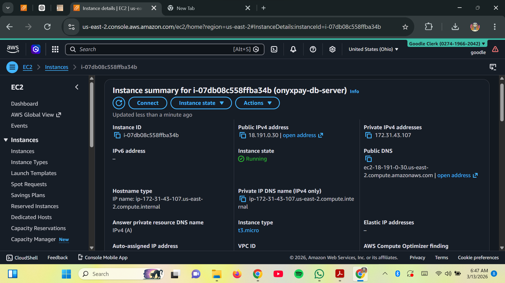

---

2. **Create and Attach EBS Volume**
    - Created a secondary EBS volume
    - Size: 10–20GB
    - Attached to the EC2 instance
Purpose:
Separate database storage from the operating system.
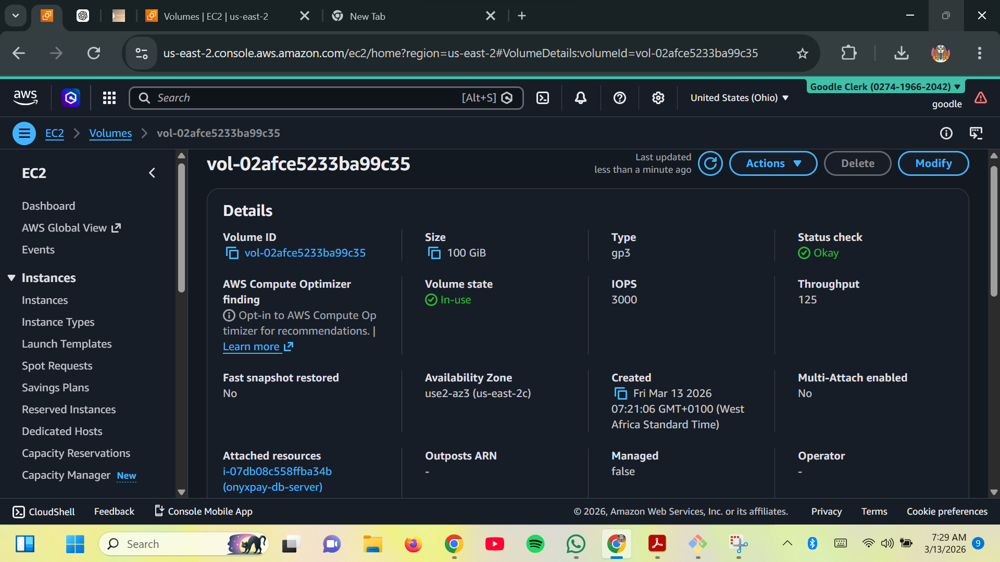
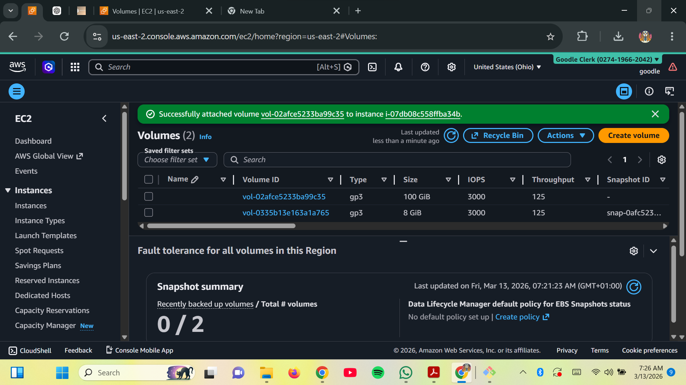

---

3. **Configure Linux Disk**

Steps performed:
- Identify new disk using lsblk
- Create partition
- Format disk using ext4
- Mount volume to:
    ```/var/lib/mysql```
Persistence configured using:
    ```sudo nano /etc/fstab```
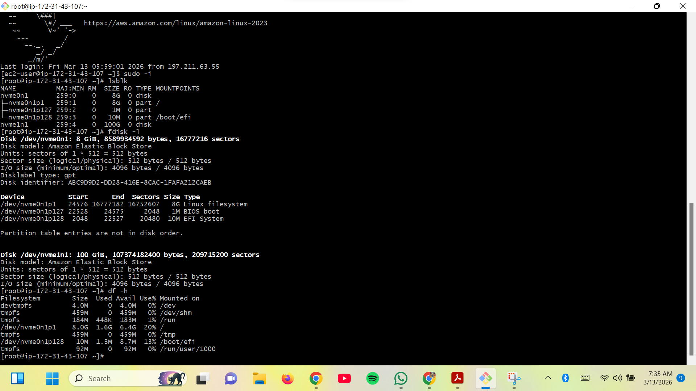
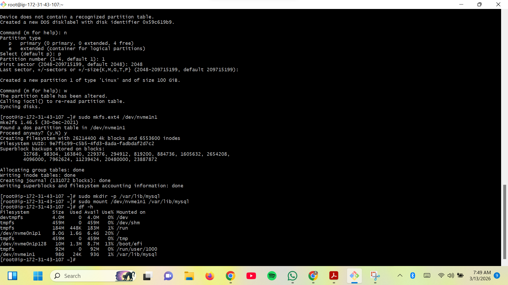
---

4. **Install MariaDB**

Commands used:
```
sudo dnf install mariadb105-server 
sudo systemctl start mariadb
sudo systemctl enable mariadb
```
Database validation:
   - Created database onyxpay_db
   - Created test table
   - Inserted sample records
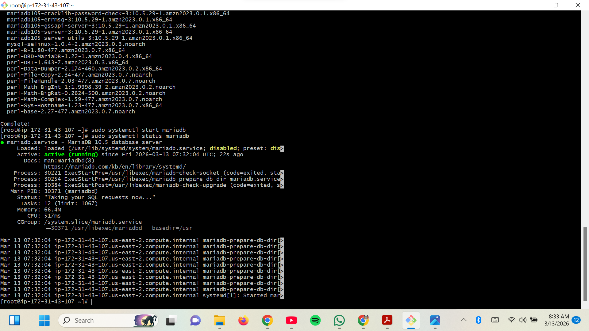
---

5. **Validate EBS Storage Dependency**

Test performed:
- Stop MariaDB
- Unmount EBS volume
- Observe MariaDB failure
- Remount volume
- Restart MariaDB
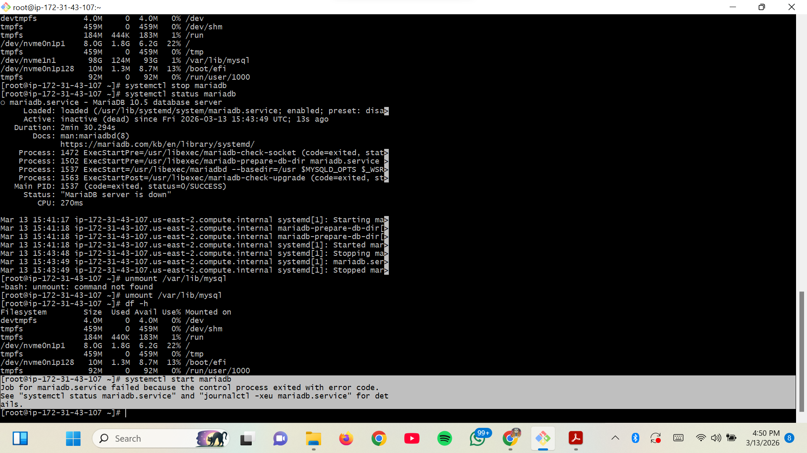
Result:
MariaDB only functions when the EBS volume is mounted, proving that database data resides on the EBS volume.

---

6. **Create Snapshot Backup**

Snapshot created:
```onyxpay-db-backup-v1```

Purpose:
- Protect database data
- Enable point-in-time recovery
- Ensure disaster recovery capability
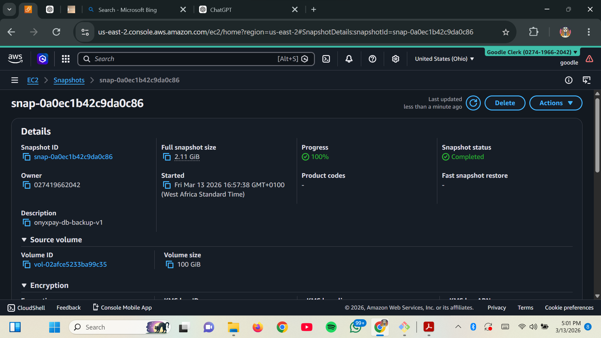
---

7. **Simulate Data Loss**

To simulate a real failure:
- Database was deleted from Mariadb ```DROP DATABASE onyxpay_db;```
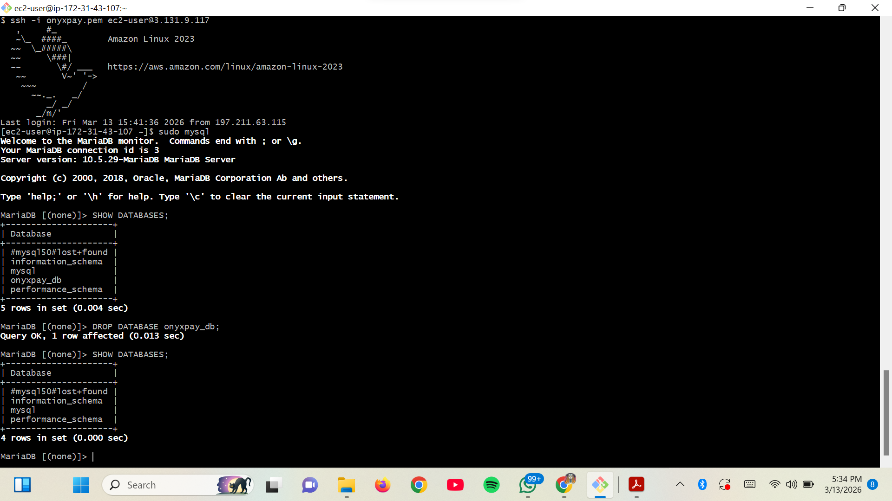
Result:
- Database became inaccessible
- MariaDB returned errors
---

8. **Restore Database from Snapshot**

Recovery process:
- Create new EBS volume from snapshot
- Detach damaged volume
- Attach restored volume
- Mount to /var/lib/mysql
- Restart MariaDB
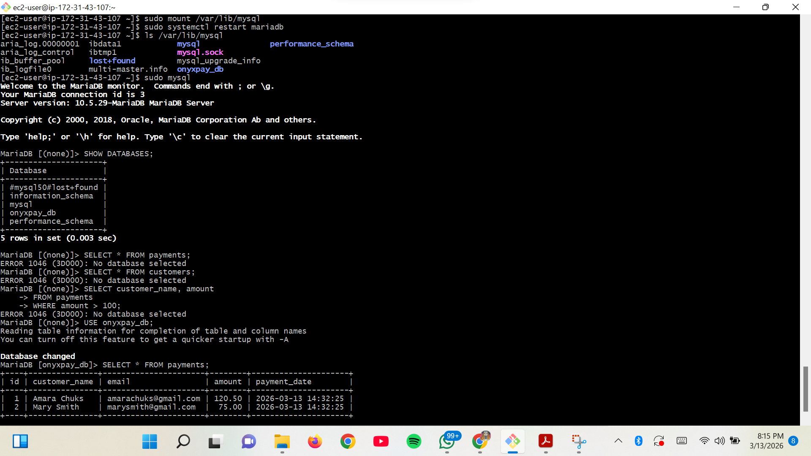
Result:
The database was fully restored from the snapshot.


